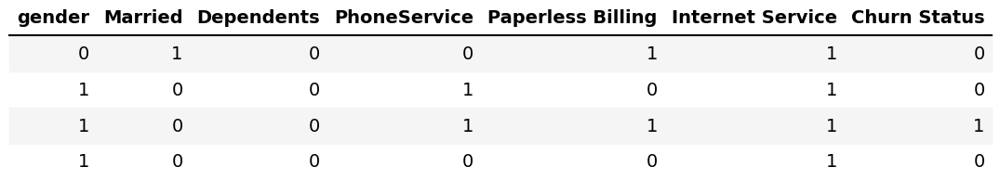
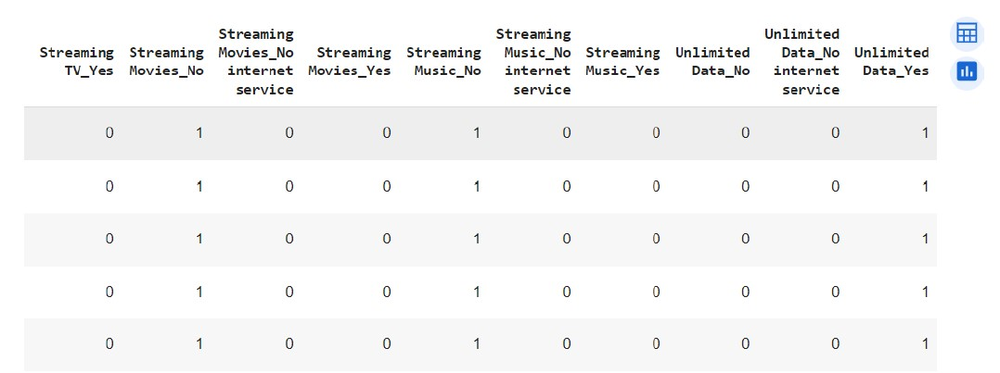
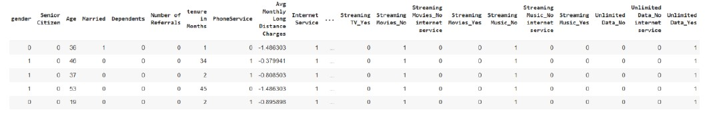
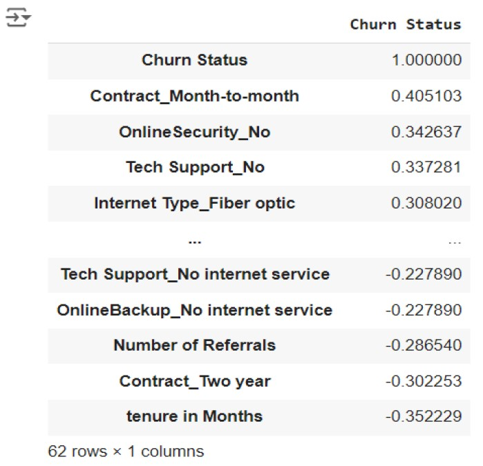

# Exploring the use of customer data in predicting and preventing customer churn in a TELCO
## Data Analytics project - Telecommunications
## Table of Contents
- [Project Overview](#project-overview)
- [Data Sources](#data-sources)
- [Tools](#tools)
- [Data Cleaning/Preparation](#data-cleaningpreparation)   <!-- the slash is removed -->
- [Exploratory Data Analysis](#exploratory-data-analysis)
- [Data Analysis](#data-analysis)
- [PRACTICAL RECOMMENDATIONS](#practical-recommendations)
- [Analysis Limitations](#analysis-limitations)
- [References](#references)

### Project Overview
This project explores the use of a Telecom provider's customer data to predict customer churn and recommend strategies.
Leveraging on the Telco customer data to provide insights into ways of adopting customer retention strategies.
Using techniques such as K-Nearest Neighbours to make classifications and predictions of telco customer behaviours and the likelihood of customer’s exit from telco service.

### Data Sources
Using SQL, data was extracted from the Telco’s enterprise database across three entities—Customer (Customer Info), Billing/Payment, and Service Usage. Records were joined using the shared unique customer_id (Account Key), conformed to the data model, materialized as a curated table, and exported to Customer_Data.csv.
### Tools 
- Python (Gooogle Colab) - Data Cleaning and Analysis
- Power BI - Report Visualisation

### Data Cleaning / Preparation
In this stage, the following steps were completed:

1. **Extracted from enterprice data base usine SQL** Data was extracted from the enterprise data base across the *customer(customer info)*, *Account(billing & payments)*, and *Service Usage(events)* Entities.
2. **Joined on shared keys** The three entities were joined on the shared customer_id key to build a clean **star-schema** data model for analytical use.
4. **Profiled the data** (row counts, nulls, types, distincts) to spot quality issues early.
5. **Standardised data columns** — prepared data to make suitable for KNN and regression analysis.
6. **Removed/Masked PII** (personally identifiable information) to meet privacy and ethical guidelines.
7. **Handled missing values** — Imputed mean value of the Total charges for 11 blank cells under Total Charges column.
8. **Deduplicated and cleaned errors/outliers** (obvious typos, impossible values, negative amounts and wrong category labels where corrected).
9. **Converted categorical columns to binary** This is to enable usage by the machine learning algorithms.
10. **One-hot encoding for multi-categorical columns** Separate columns were created for each categories in columns with multi-category values.
11. **One-hot encoded multi-categorical columns were converted to Integers/binary** This is for machine learning use.
12. **Standard scaler applied to numerical columns** such as Average Monthly Long-Distance Charges and Monthly Charges columns. This helps put the values in the same scale.
13. **Validated joins and totals** — cross-checked counts and key integrity after transformations.
15. **Materialised the curated dataset** to `Customer_Data.csv` for downstream analysis and Power BI reporting.

### Exploratory Data Analysis
EDA involved exploring the Customer_Data.csv to answer key questions such as:

1. Which customer data points most predictive of customer churn from the telecom subscription and use?
2. What are the most corrrlated variables to Churn Status in the data

### Data Analysis
```python
1. Inspection of the data
#Reading the data using pandas
df = pd.read_csv('/content/Customer_Data.csv')
#observing the data shape
df.shape
(7043, 39)


```
.png)

```python
print(df['Offer'].head(10))

0    Offer E
1        NaN
2        NaN
3        NaN
4        NaN
5        NaN
6    Offer D
7    Offer D
8    Offer C
9    Offer B
Name: Offer, dtype: object
```

### A review of the data reveals that the null/NaN vales are ‘None’. This means the customer was not given a promotional offer.
### The NaN values would be replaced with 'None' which would be added as a category under the Offer Column
(for customers without a promotional offer).

```python

df['Offer'] = df['Offer'].fillna('None')

df['Offer'] = df['Offer'].astype('category')

print(df['Offer'].head(10))

0    Offer E
1       None
2       None
3       None
4       None
5       None
6    Offer D
7    Offer D
8    Offer C
9    Offer B
Name: Offer, dtype: category
Categories (6, object): ['None', 'Offer A', 'Offer B', 'Offer C', 'Offer D', 'Offer E']

```

#### "None" us now a valid category in the Offer Column.
This is because promotional offers is a valid variable in the context of customer churn analysis.
Customer adoption of promotional offer or not, could influence churn behaviour.

```python

df.isnull().sum()

columns_to_check = ['OnlineSecurity', 'OnlineBackup', 'DeviceProtection plan',
                    'Tech Support', 'Streaming TV', 'Streaming Movies',
                    'Streaming Music', 'Unlimited Data']

for col in columns_to_check:
    unique_values = df[col].unique()
    print(f"Unique values in {col}: {unique_values}")

Unique values in OnlineSecurity: ['No' 'Yes' 'No internet service']
Unique values in OnlineBackup: ['Yes' 'No' 'No internet service']
Unique values in DeviceProtection plan: ['No' 'Yes' 'No internet service']
Unique values in Tech Support: ['No' 'Yes' 'No internet service']
Unique values in Streaming TV: ['No' 'Yes' 'No internet service']
Unique values in Streaming Movies: ['No' 'Yes' 'No internet service']
Unique values in Streaming Music: ['No' 'Yes' '0']
Unique values in Unlimited Data: ['Yes' 'No' '0']

```

Unique values check shows that the third category of ‘No internet service’ is presented as ‘0’
for Streaming Music and Unlimited Data.
‘0’ will be cahanged to ‘No internet service’ like others multi categorical columns.

```python
df['Streaming Music'] = df['Streaming Music'].replace('0', 'No internet service')
df['Unlimited Data'] = df['Unlimited Data'].replace('0', 'No internet service')

columns_to_check = ['Streaming Music', 'Unlimited Data']
for col in columns_to_check:
    unique_values = df[col].unique()
    print(f"Unique values in {col} after replacement: {unique_values}")

Unique values in Streaming Music after replacement: ['No' 'Yes' 'No internet service']
Unique values in Unlimited Data after replacement: ['Yes' 'No' 'No internet service']

```

#### For KNN and regression models, all categorical data columns with YES and/or NO values are changed to 1 and 0 (binary).
This is because machine learning algorithms and models use numerical input.

```python

df['gender'] = df['gender'].map({'Female': 0, 'Male': 1})
df['Married'] = df['Married'].map({'No': 0, 'Yes': 1})
df['Dependents'] = df['Dependents'].map({'No': 0, 'Yes': 1})
df['PhoneService'] = df['PhoneService'].map({'Yes': 1, 'No': 0})
df['Paperless Billing'] = df['Paperless Billing'].map({'Yes': 1, 'No': 0})
df['Internet Service'] = df['Internet Service'].map({'Yes': 1, 'No': 0})
df['Churn Status'] = df['Churn Status'].map({'Yes': 1, 'No': 0})

cols = ['gender','Married','Dependents','PhoneService',
        'Paperless Billing','Internet Service','Churn Status']

first4 = df[cols].head(4)     # or df[cols].iloc[:4]
print(first4)

```


### One-hot encoding has created columns for each categories. 
For example, the Streaming Movies column has now split to Streaming Movies_No, Streaming Movies_Yes and Streaming Movies_No internet service. 
However, their values are in Boolean values (True/False) instead of integers (1/0).

One-hot encoding is good for KNN and Logistic regression because it helps presents each 
category as a binary column which would clearly help as a datapoint in allocating clusters or line of best fit. 
This was chosen over Label Encoder in this report because Label Encoder may wrongly imply an ordinal relationship (WU et al 2022)

### One-hot encoded multi-categorical columns have been converted to Integers/binary for machine learning use

```python

df['gender'] = df['gender'].map({'Female': 0, 'Male': 1})
df['Married'] = df['Married'].map({'No': 0, 'Yes': 1})
df['Dependents'] = df['Dependents'].map({'No': 0, 'Yes': 1})
df['PhoneService'] = df['PhoneService'].map({'Yes': 1, 'No': 0})
df['Paperless Billing'] = df['Paperless Billing'].map({'Yes': 1, 'No': 0})
df['Internet Service'] = df['Internet Service'].map({'Yes': 1, 'No': 0})
df['Churn Status'] = df['Churn Status'].map({'Yes': 1, 'No': 0})
```



```python

df = pd.get_dummies(df, columns=['Internet Type', 'Contract', 'Payment Method', 'MultipleLines' ,'Offer', 'OnlineSecurity', 'OnlineBackup',
                                 'DeviceProtection plan','Tech Support', 'Streaming TV','Streaming Movies',
                                 'Streaming Music', 'Unlimited Data'], drop_first=False)

```
#### Change boolean columns to integer data type
```python
boolean_columns = ['Internet Type_DSL',
   'Internet Type_Fiber optic', 'Internet Type_No',
       'Contract_Month-to-month', 'Contract_One year', 'Contract_Two year',
       'Payment Method_Bank transfer (automatic)',
       'Payment Method_Credit card (automatic)',
       'Payment Method_Electronic check', 'Payment Method_Mailed check',
       'MultipleLines_No', 'MultipleLines_No phone service',
       'MultipleLines_Yes', 'Offer_Offer A', 'Offer_Offer B', 'Offer_Offer C',
       'Offer_Offer D', 'Offer_Offer E', 'Offer_None', 'OnlineSecurity_No',
       'OnlineSecurity_No internet service', 'OnlineSecurity_Yes',
       'OnlineBackup_No', 'OnlineBackup_No internet service',
       'OnlineBackup_Yes', 'DeviceProtection plan_No',
       'DeviceProtection plan_No internet service',
       'DeviceProtection plan_Yes', 'Tech Support_No',
       'Tech Support_No internet service', 'Tech Support_Yes',
       'Streaming TV_No', 'Streaming TV_No internet service',
       'Streaming TV_Yes', 'Streaming Movies_No',
       'Streaming Movies_No internet service', 'Streaming Movies_Yes',
       'Streaming Music_No', 'Streaming Music_No internet service',
       'Streaming Music_Yes', 'Unlimited Data_No',
       'Unlimited Data_No internet service', 'Unlimited Data_Yes']

```
#### Apply Standard Scaler to numerical columns
Standard scaler was applied to numerical columns such as Average Monthly Long-Distance Charges, and Monthly Charges. Code in Appendix 20. This ensures that all the values have mean of 0 and standard deviation of 1 which helps put the values in the same scale.
```python
from sklearn.preprocessing import StandardScaler

numerical_cols = ['Avg Monthly Long Distance Charges',
                  'Avg Monthly GB Download',
                  'Monthly Charges',
                  'Total Charges',
                  'Total Refunds',
                  'Total Extra Data Charges',
                  'Total Long Distance Charges',
                  'Total Revenue']


scaler = StandardScaler()

df[numerical_cols] = scaler.fit_transform(df[numerical_cols])

df.head()
```
Below shows the outcome after all categorical columns have been turned to binary, 
feature scaling have been applied to numerical columns, and irrelevant columns have been dropped.



## CRITICAL ANALYSIS OF DATA USINGS MACHINE LEARNING METHODS
### Correlation of variables to Churn Status

```python
df.corr()['Churn Status'].sort_values(ascending = False)

```


This shows that the most correlated variables to Churn status are Monthly Contracts, Lack of Online Security Subscription, and Lack of Tech Support.

## MACHINE LEARNING (KNN)
### Using All Data Set Variables
For the KNN model, our Feature Data set will be all Columns in the data except the Churn Status Column. Hence, we separate the Churn Status column. Churn Status is our Target Data for analysis.
Feature data is defined as X and Target data is defined as y.
We then split our data to train and test data.
We have chosen the n Neighbours 11 to prevent overfitting
As seen in figure 20, our KNN model fit would be the trained data for X and y.
Our KNNpredict is the X-test showing the churn prediction of 1 or 0 for all the rows (each of all the customers) in the test sample(test).
A check of the X-test data shows 2,113 rows. Hence, we have churn prediction for 2,113 customers with varying data sets.

```Python
X = df.drop(columns = ['Churn Status'], axis=1)
y = df['Churn Status'].values

X_train, X_test, y_train, y_test = train_test_split(X,y,test_size = 0.30, random_state = 40, stratify=y)


df['Offer'] = df['Offer'].replace('None', 'None')


#The bank rows are replaced with mean of each column and 
df_Ishort_haul['Wifi & Connectivity'].fillna(df_Ishort_haul['Wifi & Connectivity'].mean(), inplace=True)
df_Ishort_haul['Inflight Entertainment'].fillna(df_Ishort_haul['Inflight Entertainment'].mean(), inplace=True)
df_Ishort_haul['Food & Beverages'].fillna(df_Ishort_haul['Food & Beverages'].mean(), inplace=True)
df_Ishort_haul['Seat Comfort'].fillna(df_Ishort_haul['Seat Comfort'].mean(), inplace=True)
df_Ishort_haul['Cabin Staff Service'].fillna(df_Ishort_haul['Cabin Staff Service'].mean(), inplace=True)
df_Ishort_haul['Ground Service'].fillna(df_Ishort_haul['Ground Service'].mean(), inplace=True)

```

### Pearson Correlation Coefficient
Columns that are not relevant to the T-tests and Pearson correlation coefficient Analysis would be deleted from the df_Ishort_haul DataFrame

```python
df_Ishort_haul = df_Ishort_haul.drop(columns=['S/N','reviewer_detail', 'reviews','Type Of Traveller', 'Route', 'Date Flown', 'Aircraft','Seat Type']
```


```Python
correlation_result = df_Ishort_haul.corr()['Recommended'].sort_values(ascending=False)
print(correlation_result)

Recommended               1.000000
Ground Service            0.675204
Seat Comfort              0.604414
Cabin Staff Service       0.598581
Food & Beverages          0.552210
Inflight Entertainment    0.288967
Wifi & Connectivity       0.238077
Name: Recommended, dtype: float64
```


Result indicates that improvement in all the service factors would result to improvement of customer recommendations (Which is a proxy to satisfaction). All the service factors show positive correlation.

However, prioritising the most correlated factors would optimise cost and increase efficiency. This is because some service factors are less correlated than others.
The highest correlation comes from Ground service while the lowest is from Wifi & Connectivity.

## PRACTICAL RECOMMENDATIONS
Based on the findings, the following are recommended to British Airways' for Short Haul Flights.

- Ground Service: Allocate resources to improve ground services, such as upgrading mobile apps for seamless check-in, enhancing lounge facilities, and providing better accessibility for passengers with disabilities. These improvements would make Ground Services very satisfactory.

- Cabin staff service: Invest in continuous training for cabin staff to improve customer interactions and service quality.

- Seat Comfort: Enhance seat designs and comfort to meet customer expectations.

- Inflight Entertainment and Wi-Fi Connectivity: While these factors are less significant, they should still be maintained at a satisfactory level, but with lower priority compared to other services.

### Analysis Limitations
This study has provided valuable insights into customer satisfaction and operational efficiency for British Airways. However, some of the research limitations includes:

- Incomplete Data: Some columns had missing data, which were filled with mean values, potentially impacting the analysis.
- Text Data Sample Size: Limitation of the sample size of data might limit the generalisability of the findings.

### References
Skytrax (2024), British Airways Customer reviews. Available at: https://www.airlinequality.com/airline-reviews/british-airways (Accessed: 10 June 2024)

